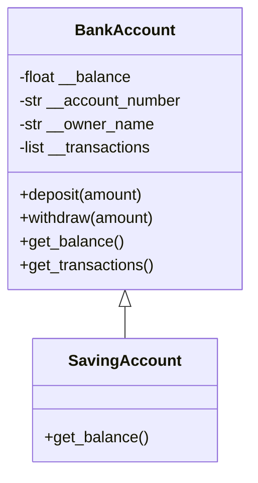

# Simple Banking System (CLI)
 
**A command-line banking application built in Python as an applied project for core Python and object-oriented programming fundamentals — encapsulation, inheritance, and method overriding.**
 

 

---
 
## Table of Contents
- [Overview](#overview)
- [Class Diagram](#class-diagram)
- [Key Features](#key-features)
- [Tech Stack](#tech-stack)
- [Skills Demonstrated](#skills-demonstrated)
- [Author](#author)
---
 
## Overview
 
A menu-driven, command-line banking system where users can create accounts, log in, and manage their money — deposits, withdrawals, balance checks, and a timestamped transaction history. Built specifically as an applied project to practice core Python fundamentals and object-oriented programming: encapsulated account data, class inheritance, and method overriding.
 
## Class Diagram
 

 
**How to read it:** `BankAccount` encapsulates all account data as private attributes (double-underscore name-mangled in Python) and only exposes them through controlled methods like `deposit()` and `withdraw()`, which validate input before changing the balance. `SavingAccount` inherits from `BankAccount` and overrides `get_balance()`, calling `super().get_balance()` to reuse the parent's logic while adding a print statement on top — a basic, working example of method overriding via inheritance. It's intentionally minimal: the override doesn't change the returned value or add real business logic (e.g., interest calculation), so it demonstrates the *mechanics* of overriding rather than a meaningful behavioral difference.
 
## Key Features
 
- Create multiple accounts of two types: standard `BankAccount` or `SavingAccount`
- Login system that routes to a per-account menu
- Deposit and withdraw funds with validation (rejects zero, negative, or insufficient-balance operations)
- Timestamped transaction history logged for every deposit and withdrawal
- Defensive input handling — invalid (non-numeric) amounts are caught and re-prompted instead of crashing
## Tech Stack
 
`Python` · `Object-Oriented Programming` · `Exception Handling` · `CLI Design`
 
## Skills Demonstrated
 
- **Encapsulation** — protecting account data with private attributes and controlled access methods
- **Inheritance & Method Overriding** — `SavingAccount` extending `BankAccount` and overriding `get_balance()`, using `super()` to reuse parent logic
- **Input Validation & Error Handling** — using `try`/`except` to gracefully handle invalid user input
- **State Management** — tracking multiple accounts and their transaction histories in memory
- **CLI/UX Design** — structuring a clear, menu-driven text interface for a multi-step user flow
## Author
 
**Wajd Sameer Al Luhaybi**
Computer Science Student | Data Analysis & Software Development
 

